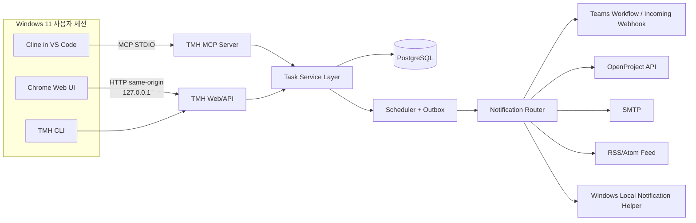
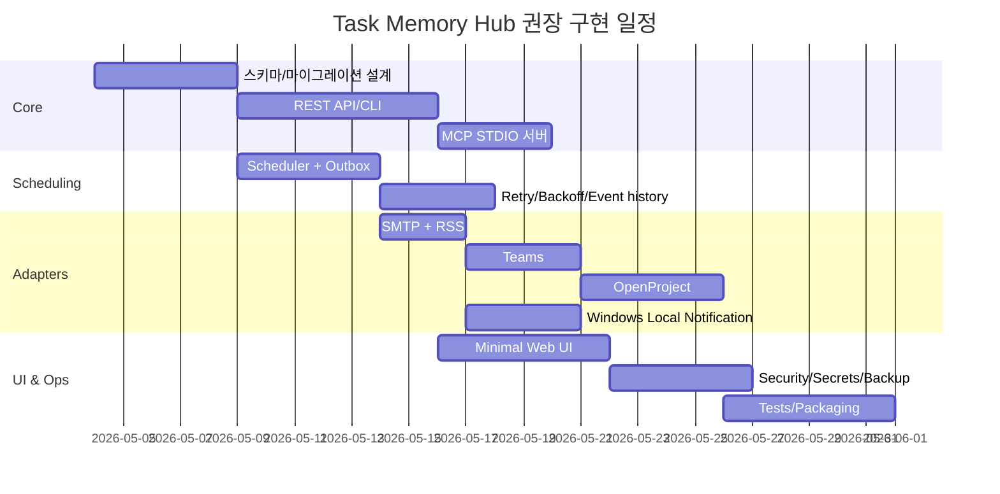

# Task Memory Hub 설계 명세

## 2026-05-02 구현 기준 보정

이 문서는 초기 제품 설계 명세다. 현재 구현과 운영 결정은 아래 보정 기준을 함께 따른다.

- 현 단계 기본 DB는 SQLite다. PostgreSQL은 장기 운영 backend 후보로 유지하되, 지금 앱 기능 구현의 선행조건으로 두지 않는다.
- global hub는 full context 저장소가 아니라 thin manifest/control-plane이다. 자세한 context는 `origin_task_id`, `source_workspace_id`, fetch refs로 원본 workspace에서 역추적한다.
- 실행 계층은 `docs/harness-runner-governance-development-spec.md`를 기준으로 한다.
- Orchestrator는 배정자이고, Harness Runner는 실행 감독자다. Cline, Deepagents, Codex, script는 TMH에 붙는 execution backend 또는 client다.
- 최상위 운영권은 사람에게 있다. Web UI는 provenance, authority, runtime, claim state, backend, progress, artifacts, stop semantics를 드러내는 관제면이어야 한다.
- Cline IDE process launch/control은 아직 제품 요구로 확정하지 않는다. Cline은 우선 STDIO MCP client로 TMH task를 읽고 보고하는 흐름을 기본으로 둔다.

## 요약

Task Memory Hub는 Cline이 작업 중 도출한 TODO를 워크스페이스 내부 메모에서 꺼내 **로컬 우선의 지속 작업 시스템**으로 승격시키는 앱이어야 한다. 현재 Cline은 Rules, Skills, Workflows, Hooks, Memory Bank, MCP를 제공하며, 특히 Memory Bank는 세션 간 프로젝트 맥락을 유지하는 데 유용하다. 하지만 Memory Bank 자체는 “기억” 계층이지, 시간 기반 재호출·재알림·재배정까지 담당하는 실행 계층은 아니다. 따라서 본 설계는 **Memory Bank는 그대로 두고**, 그 위에 **Task Memory Hub를 별도 앱으로 두는 이원 구조**를 권고한다. Cline 연동은 네트워크 노출이 없는 **STDIO MCP**가 기본이며, 웹 UI와 REST API는 **127.0.0.1** 루프백에만 바인딩한다. citeturn12view3turn12view2turn24view2turn24view0

핵심 권고는 다음과 같다. 데이터 저장소는 SQLite를 “부트스트랩/개발/비상 대체”로만 허용하고, **기본 권고는 로컬 entity["organization","PostgreSQL Global Development Group","database maintainers"] 기반 PostgreSQL**이다. 이유는 SQLite가 WAL 모드에서도 본질적으로 **single-writer** 제약을 가지며, WAL은 **동일 호스트**에서만 유효하고 특정 상황에서 `SQLITE_BUSY`가 반환될 수 있기 때문이다. 반면 PostgreSQL은 행 수준 잠금, 고동시성에서 원자적 `ON CONFLICT`, 큐형 테이블에 적합한 `SKIP LOCKED`, `LISTEN/NOTIFY`, `pg_dump`/`pg_restore`, `pg_upgrade`, JSON 로그 등 운영 기능이 더 낫다. Task Memory Hub는 스케줄러·UI·CLI·MCP·알림 라우터가 동시에 DB를 만질 수 있으므로, 생산 환경 기본값은 PostgreSQL이 맞다. citeturn15view1turn15view2turn15view3turn16view0turn11view0turn30search0turn11view3turn20search0turn25search0

또한 이 앱은 **단일 Python 코드베이스, 네 개의 엔트리포인트**로 설계하는 것이 가장 단정하다. 즉 `tmh-web`(웹 UI+REST), `tmh-worker`(스케줄러+라우터), `tmh-mcp`(Cline용 STDIO MCP 서버), `tmh`(CLI)로 나누되, 내부에서는 하나의 서비스 레이어와 하나의 마이그레이션 체계를 공유한다. 이렇게 하면 런타임에 Codex가 없어도 Cline만으로 작업 등록·연기·완료·재개가 가능하고, 나중에 Codex로 구현하더라도 런타임 복잡도가 증가하지 않는다. citeturn12view2turn12view0turn24view2

## 권고 아키텍처

Cline 측 통합은 **항상 로컬 STDIO MCP**를 우선해야 한다. Cline 문서상 STDIO transport는 로컬 프로세스 간 표준 입출력 통신이며, 낮은 지연·직접 통신·네트워크 비노출이라는 장점이 있고, 보안 민감 작업에 적합하다. 동시에 Cline은 `.clinerules`, Workflows, Skills를 서로 다른 목적에 맞게 조합할 수 있다. 따라서 Task Memory Hub는 **(a) always-on Rule**, **(b) 명시적으로 호출하는 Workflow**, **(c) 필요 시 on-demand Skill**, **(d) 실제 작업 수행은 MCP tool**의 4층 구조가 가장 적합하다. citeturn12view2turn22view0turn24view0turn24view1turn24view2



이 아키텍처에서 중요한 점은 **MCP와 REST를 분리**하는 것이다. Cline은 브라우저나 REST 인증·CSRF 문제를 알 필요가 없다. `tmh-mcp`는 STDIO로만 동작하고, 내부 서비스 계층을 직접 호출한다. 반대로 브라우저와 CLI는 REST를 사용하되, 브라우저는 쿠키 세션+CSRF, CLI는 로컬 토큰 헤더를 사용한다. 이 분리는 공격면을 줄이고, 127.0.0.1 HTTP를 외부 자동화용으로 열어두면서도 Cline 경로는 더 좁고 안전하게 유지한다. citeturn12view2turn12view0turn17search2

### 실행 엔트리포인트

| 엔트리포인트 | 역할 | 운영 권고 |
|---|---|---|
| `tmh-web` | Web UI, REST API, RSS/Atom, health endpoints | 기본 포트 `127.0.0.1:8787` |
| `tmh-worker` | reminder scan, outbox dispatch, retry/backoff | 기본은 같은 사용자 세션에서 자동 시작 |
| `tmh-mcp` | Cline용 STDIO MCP | Cline이 child process로 spawn |
| `tmh` | CLI (`today`, `due`, `ack`, `snooze`, `done`, `backup`) | 운영/디버그/자동화 |

## 저장소 선택과 데이터 모델

### 저장소 선택

SQLite는 Python 표준 라이브러리 `sqlite3`를 통해 즉시 사용할 수 있고, WAL·UPSERT·부분 인덱스·라이브 백업까지 지원한다. 따라서 개발 초기, 테스트, 단일 프로세스 실험에는 매우 좋은 선택이다. 그러나 SQLite는 직렬화 가능한 격리를 **“쓰기 직렬화”** 방식으로 제공하며, 동시에 **단일 writer만 허용**한다. WAL은 읽기/쓰기 동시성을 높여 주지만, 여전히 멀티 writer 시스템이 아니고, WAL 파일 공유 때문에 **같은 호스트에서만** 안전하다. Task Memory Hub처럼 웹 UI, API, 스케줄러, MCP, 알림 라우터가 동시에 같은 저장소를 두드리는 경우에는 SQLite가 병목과 운영 리스크를 만든다. citeturn29search0turn15view1turn15view2turn15view3turn26search0turn26search1

PostgreSQL은 행 수준 잠금이 조회를 막지 않고, `ON CONFLICT DO UPDATE`가 고동시성에서도 원자적 upsert를 보장하며, `SKIP LOCKED`로 큐형 소비 모델을 안정적으로 만들 수 있다. 또한 `LISTEN/NOTIFY`는 UI 갱신 신호로 유용하고, `pg_dump -Fc`/`pg_restore`, `pg_upgrade --check`, `jsonlog`, `pg_stat_statements` 등 생산 운영 기능이 풍부하다. 따라서 **SQLite는 fallback**, **PostgreSQL은 default**가 적절하다. citeturn11view0turn16view0turn30search0turn11view6turn11view3turn20search0turn25search0turn16view2

### SQLite와 PostgreSQL 비교

| 항목 | SQLite | PostgreSQL | 권고 |
|---|---|---|---|
| 초기 설치 | 매우 쉬움, 파일 하나 | 설치 필요, 서비스 운영 필요 | 개발 초기는 SQLite 가능 |
| 동시성 | single-writer, WAL로 reader/writer 개선 | row lock, MVCC, queue-friendly locking | 운영 기본은 PostgreSQL |
| upsert/idempotency | UPSERT 지원 | `ON CONFLICT` + `RETURNING` + 원자성 우수 | PostgreSQL 우세 |
| 알림/실시간성 | 내장 DB 이벤트 버스 없음 | `LISTEN/NOTIFY` 제공 | PostgreSQL 우세 |
| 백업 | Backup API, `VACUUM INTO` | `pg_dump -Fc`, `pg_restore` | 둘 다 가능하나 Postgres 운영성 우세 |
| 데이터 이식 | 파일 복사 쉬움 | 논리/물리 백업 체계 성숙 | 운영·업그레이드에서는 PostgreSQL |
| 제약/리스크 | WAL same-host, `SQLITE_BUSY` edge cases | 설치/권한 설정 필요 | 단일사용 실험은 SQLite, 실사용은 PostgreSQL |

SQLite WAL과 single-writer, Backup API/VACUUM INTO, PostgreSQL row lock/upsert/backup/upgrade 근거는 공식 문서를 따랐다. citeturn15view1turn15view2turn15view3turn15view4turn15view6turn11view0turn16view0turn11view3turn20search0turn20search1

### 데이터 모델 원칙

핵심 원칙은 **관계형 코어 + 제한적 JSON 확장**이다. SQLite→PostgreSQL 이행 가능성을 유지하려면 핵심 업무 테이블은 가급적 `TEXT/INTEGER/TIMESTAMP/BOOLEAN` 중심으로 유지하고, PostgreSQL 전용 `jsonb`는 `ai_context_pack`, adapter snapshot, 진단 메타데이터처럼 “유연하지만 핵심 제약이 약한” 영역에만 쓴다. 이 원칙은 마이그레이션을 단순하게 만들고, SQLite 단계에서도 같은 논리 스키마를 유지하게 해 준다.

### 작업 객체 표준 스키마

| 필드 | 타입 | 필수 | 설명 | 인덱스 |
|---|---|---:|---|---|
| `task_id` | UUID | 예 | 내부 PK | PK |
| `idempotency_key` | TEXT | 예 | 동일 tool call 재시도/중복 등록 방지 | UNIQUE |
| `status` | ENUM/TEXT | 예 | `inbox`, `scheduled`, `notified`, `acknowledged`, `snoozed`, `in_progress`, `completed`, `cancelled`, `archived` | 상태 인덱스 |
| `priority` | SMALLINT/TEXT | 예 | `low`, `normal`, `high`, `urgent` | 상태+우선순위 복합 |
| `title` | VARCHAR(180) | 예 | 한 줄 제목 | 검색 인덱스 |
| `summary` | TEXT | 예 | 배경과 목적 요약 | 전문검색 선택 |
| `next_action` | TEXT | 예 | 다음 한 번의 실행 행동 |  |
| `detail_md` | TEXT | 아니오 | 긴 메모/설명 |  |
| `due_at` | TIMESTAMPTZ | 아니오 | 기준 만기 | due 인덱스 |
| `snooze_until` | TIMESTAMPTZ | 아니오 | 연기 시각 | due 인덱스 |
| `ack_at` | TIMESTAMPTZ | 아니오 | 사용자가 알림을 확인한 시각 |  |
| `completed_at` | TIMESTAMPTZ | 아니오 | 완료 시각 |  |
| `source_agent` | TEXT | 예 | `cline`, `manual`, `api` |  |
| `source_workspace` | TEXT | 예 | VS Code workspace 식별자 | workspace 인덱스 |
| `source_repo` | TEXT | 아니오 | repo URI 또는 logical name |  |
| `source_branch` | TEXT | 아니오 | 브랜치 |  |
| `source_session_id` | TEXT | 아니오 | Cline task/session 식별자 |  |
| `source_files_preview` | TEXT | 아니오 | 대표 파일 목록 요약 |  |
| `fingerprint_sha256` | CHAR(64) | 예 | normalized title/next_action/source 조합 해시 | UNIQUE 또는 보조 인덱스 |
| `ai_context_pack` | JSON/JSONB | 예 | 재개용 구조화 컨텍스트 |  |
| `ai_context_preview` | TEXT | 예 | 알림용 1~3문장 축약 |  |
| `redaction_level` | SMALLINT | 예 | 민감도/마스킹 수준 |  |
| `created_at` | TIMESTAMPTZ | 예 | 생성 시각 | created 인덱스 |
| `updated_at` | TIMESTAMPTZ | 예 | 수정 시각 | updated 인덱스 |

### 보조 테이블

| 테이블 | 목적 |
|---|---|
| `task_tags` | 다중 태그 |
| `task_artifacts` | 관련 파일/URL/문서 식별자 |
| `task_reminders` | reminder due row, channel별 예약 |
| `task_events` | 상태 전이 이력 |
| `notification_jobs` | outbox 큐 |
| `notification_attempts` | 채널별 전송 시도/에러 추적 |
| `external_refs` | OpenProject work package 등 외부 연결 |
| `settings` | 채널 설정/정책 |
| `secret_refs` | Credential Manager/DPAPI에 저장된 secret 참조 키 |

### `ai_context_pack` 설계

`ai_context_pack`는 단순히 “이전 대화 요약”이 아니라, **Cline이 며칠 뒤 재개할 수 있는 최소 완결 단위**여야 한다. 권장 구조는 아래와 같다.

| 키 | 필수 | 설명 |
|---|---:|---|
| `version` | 예 | 스키마 버전 |
| `objective` | 예 | 이 작업의 최종 목적 |
| `why_it_exists` | 예 | 왜 이 task가 생겼는지 |
| `current_state` | 예 | 현재 결정 사항/보류 사유 |
| `next_action` | 예 | 다음 한번의 행동 |
| `acceptance_criteria` | 예 | 완료 판단 기준 |
| `relevant_files` | 아니오 | 경로 목록 |
| `relevant_urls` | 아니오 | 문서/API 링크 |
| `commands_hint` | 아니오 | 재개 시 유용한 명령 힌트 |
| `open_questions` | 아니오 | 아직 미해결 질문 |
| `constraints` | 아니오 | 수정 금지, 보안 제약 등 |
| `source_refs` | 아니오 | session/task/message 식별자 |
| `confidentiality` | 예 | `public/internal/restricted` |
| `redacted` | 예 | 민감정보 제거 여부 |

권장 정책은 **2–8 KB의 구조화 JSON + 280자 이내 preview**다. 비밀값, 토큰, 전체 diff, 장문의 stack trace는 넣지 말아야 한다. Cline Memory Bank가 세션 간 프로젝트 맥락을 유지해 주는 것은 사실이지만, 알림 재개 UX에는 더 짧고 실행지향적인 pack이 필요하다. citeturn12view3

### SQLite에서 PostgreSQL로의 이행 계획

| 단계 | 내용 | 비고 |
|---|---|---|
| 스키마 고정 | portable core schema 유지 | SQLite/PG 동형 설계 |
| 이중 지원 | 같은 마이그레이션 버전 체계 운영 | DB별 SQL 분기 최소화 |
| export | SQLite에서 task/event/reminder/outbox를 정렬 추출 | JSONL 또는 CSV |
| import | PostgreSQL에 대량 적재 | `COPY` 우선 |
| 검증 | row count, PK/FK, checksum, 최근 due task 샘플 비교 | 자동 검증 스크립트 |
| 컷오버 | SQLite read-only 전환 후 Postgres writable 활성화 | 재시도 가능 |
| 보존 | 이전 SQLite 파일 30일 read-only 보관 | 감사/롤백 대비 |

PostgreSQL `COPY`는 대량 적재에 최적화되어 있고, 대규모 데이터 적재에서 `INSERT`보다 오버헤드가 낮다. citeturn17search0turn17search4

## 인터페이스와 스케줄링

### REST API

| 메서드 | 경로 | 목적 | idempotency | 비고 |
|---|---|---|---|---|
| `POST` | `/v1/tasks` | 작업 생성/업서트 | `Idempotency-Key` 필수 | 중복 시 기존 task 반환 |
| `GET` | `/v1/tasks` | 목록/필터 | 없음 | 상태, 태그, workspace, due 범위 |
| `GET` | `/v1/tasks/{task_id}` | 상세 조회 | 없음 |  |
| `PATCH` | `/v1/tasks/{task_id}` | 제목/요약/우선순위 수정 | 선택 |  |
| `POST` | `/v1/tasks/{task_id}/ack` | 알림 확인 | 선택 | `ack_at` 기록 |
| `POST` | `/v1/tasks/{task_id}/snooze` | 연기 | 선택 | `snooze_until` 갱신 |
| `POST` | `/v1/tasks/{task_id}/complete` | 완료 | 선택 | 상태 전이 기록 |
| `POST` | `/v1/tasks/{task_id}/reopen` | 재오픈 | 선택 |  |
| `GET` | `/v1/tasks/due` | 현재 due/overdue 조회 | 없음 | CLI/대시보드용 |
| `GET` | `/v1/tasks/{task_id}/context-pack` | ai_context_pack 조회 | 없음 | Cline 재개용 |
| `POST` | `/v1/notifications/test` | 채널 점검 | 선택 | 관리자용 |
| `GET` | `/v1/feeds/rss.xml` | RSS feed | 없음 | read-only |
| `GET` | `/health/live` | 프로세스 생존성 | 없음 |  |
| `GET` | `/health/ready` | DB/worker 준비상태 | 없음 |  |

### MCP tool 인터페이스

Cline는 로컬 STDIO MCP를 통해 아래 도구를 보는 구조가 가장 적합하다. Cline은 rule/workflow/skill을 통해 언제 이 도구를 호출할지 학습하고, 실제 작업 등록은 이 도구가 책임진다. Cline Workflows는 MCP tools를 사용할 수 있고, Rules는 상시 활성화, Skills는 온디맨드 로딩 구조다. citeturn24view0turn24view1turn24view2

| 도구명 | 설명 | 필수 입력 |
|---|---|---|
| `create_task` | 새 task 생성 또는 동일 키 업서트 | `title`, `summary`, `next_action`, `priority`, `source_workspace` |
| `list_due_tasks` | due/overdue 작업 조회 | 선택적 필터 |
| `snooze_task` | 기존 작업 연기 | `task_id`, `until` 또는 `duration` |
| `complete_task` | 완료 처리 | `task_id` |
| `ack_task` | 알림 확인 | `task_id` |
| `get_task_context_pack` | 재개용 컨텍스트 반환 | `task_id` |

권장 tool description은 “explicit TODO, deferred decision, blocker, follow-up experiment, remind me later 요청 시 사용”처럼 좁고 명확해야 한다. Cline Rules는 상시 동작하므로 **“세션 종료 시 미완료 action item을 요약하고 create_task를 호출하라”**는 규칙을 넣고, 별도 Workflow는 `/capture-followups.md`처럼 사용자가 수동 실행할 수 있게 두는 편이 좋다. citeturn22view0turn24view0

### 스케줄러 설계

스케줄러는 **DB가 source of truth**여야 하며, 인메모리 타이머는 금지하는 것이 좋다. `task_reminders`에서 due row를 읽어 `notification_jobs` outbox에 넣고, 라우터는 `notification_attempts`를 기록하며 채널별로 전송한다. PostgreSQL에서는 `FOR UPDATE ... SKIP LOCKED`로 여러 worker가 경합 없이 작업을 lease할 수 있고, SQLite fallback에서는 단일 worker만 허용한다. citeturn30search0turn15view1

`LISTEN/NOTIFY`는 **UI refresh와 가벼운 invalidation**에는 적합하지만, **전달 보장 메커니즘**으로 쓰면 안 된다. 공식 문서상 `NOTIFY`는 LISTEN 중인 세션에 payload를 보낼 수 있지만, 알림은 DB의 모든 사용자에게 visible하다. 따라서 payload에는 비밀을 싣지 말고 `task_id`, `event_type` 같은 비민감 최소 신호만 보내야 한다. durable delivery는 반드시 outbox 테이블로 따로 보장해야 한다. citeturn11view2turn11view6

### 채널 어댑터 설계

| 채널 | 기본 전송 방식 | 권고 역할 | 주의점 |
|---|---|---|---|
| entity["company","Microsoft","software company"] Teams | Workflows webhook 우선, Incoming Webhook 호환 | 팀 채널 알림, 일일 digest | 28 KB 제한, 4 req/s, backoff 필요 |
| entity["organization","OpenProject","project management platform"] | API v3 work package / comment | 중요 task의 issue 승격, 상태 반영 | Notifications endpoint는 생성 API가 아님 |
| SMTP | 표준 SMTP | 개인 알림, 백업 채널 | 메일 폭주 방지 |
| RSS/Atom | read-only feed | passive subscription, dashboard 위젯 | 로컬 링크만 유효 |
| Windows local | toast helper | 즉시/가벼운 알림 | admin-elevated 불가 |
| Browser notifications | Web Notifications | 웹 UI를 열어둔 경우 보조 채널 | permission 요청 UX 중요 |

Teams는 두 모드를 동시에 지원하되, **신규 구현은 Workflows mode를 primary**로 두는 것이 바람직하다. 공식 문서상 Workflows의 “When a Teams webhook request is received” trigger는 POST 요청을 받아 adaptive card 배열을 후속 액션에 사용할 수 있고, Incoming Webhook도 card JSON을 받을 수 있다. 다만 Incoming Webhook은 메시지 크기 28 KB, 초당 4회 초과 시 throttling 제한이 있으므로, full `ai_context_pack`를 보내지 말고 `title`, `due`, `next_action`, `task_id`, optional deep link만 보내야 한다. citeturn13view4turn11view10turn13view0turn13view1turn13view2

OpenProject는 **work package 생성/수정/코멘트 추가**를 주 경로로 사용해야 한다. 공식 문서상 API는 bearer token, basic auth(apikey), OAuth2를 지원하고, work package에 대해 `addComment`, `updateImmediately` 같은 작업을 제공한다. 반면 Notifications endpoint는 “이 시스템에서 발생한 in-app notifications를 반환”하는 용도이지, 외부 시스템이 알림을 생성하는 API가 아니다. 또한 work package reminder endpoint는 사용자별 upcoming reminder를 다루므로, Task Memory Hub의 cross-channel 스케줄러를 대체하는 source of truth로 삼기보다는 부가 동기화 기능으로 제한하는 편이 맞다. citeturn13view7turn14view0turn14view5turn13view5turn27view1

SMTP는 Python 표준 라이브러리 `smtplib`와 `email.message.EmailMessage`만으로도 충분하다. 별도 메일 SDK를 들이지 않아도 되므로, “최소 의존성” 원칙에 잘 맞는다. RSS/Atom은 앱이 생성하는 read-only XML feed면 충분하며, 로컬 구독이나 사내 대시보드 위젯에 유리하다. citeturn12view6turn12view7

Windows local notification은 데스크톱·콘솔 앱에서도 가능하지만, **elevated(admin) 앱에서는 app notification이 지원되지 않는다**. 따라서 Task Memory Hub의 background worker/toast helper는 **로그인한 일반 사용자 세션**에서 돌아야 하며, 관리자 권한 서비스로 올리는 설계는 피해야 한다. 브라우저 알림은 보조 채널로만 쓰고, 권한 요청은 페이지 로드시가 아니라 사용자가 설정 화면에서 명시적으로 opt-in 했을 때만 수행해야 한다. citeturn21view0turn12view4turn12view5turn19view0

#### Teams Adaptive Card 예시

```json
{
  "type": "message",
  "attachments": [
    {
      "contentType": "application/vnd.microsoft.card.adaptive",
      "content": {
        "type": "AdaptiveCard",
        "version": "1.4",
        "body": [
          { "type": "TextBlock", "text": "Task Memory Reminder", "weight": "Bolder" },
          { "type": "TextBlock", "text": "OpenProject 동기화 정책 확정", "wrap": true },
          { "type": "TextBlock", "text": "다음 행동: work package 생성과 comment append 기준을 문서화", "wrap": true },
          { "type": "TextBlock", "text": "Due: 2026-05-07 09:00 KST", "isSubtle": true }
        ],
        "actions": [
          { "type": "Action.OpenUrl", "title": "Open Local Task", "url": "http://127.0.0.1:8787/tasks/tmh_01HX..." }
        ]
      }
    }
  ]
}
```

#### Email 예시

```text
Subject: [TMH][HIGH] OpenProject 동기화 정책 확정 — due 2026-05-07 09:00 KST

Task: OpenProject 동기화 정책 확정
Priority: high
Workspace: task-memory-hub

Summary:
Task Memory Hub의 상태/우선순위/댓글을 OpenProject work package와 어떻게 매핑할지 결정한다.

Next action:
work package 생성 규칙, 상태 매핑, comment append 조건을 문서화하고 검토한다.

Task ID:
tmh_01HX...
```

#### RSS item 예시

```xml
<item>
  <title>[high] OpenProject 동기화 정책 확정</title>
  <guid>tmh_01HX...</guid>
  <link>http://127.0.0.1:8787/tasks/tmh_01HX...</link>
  <description>다음 행동: work package 생성과 comment append 기준을 문서화</description>
  <pubDate>Tue, 05 May 2026 00:00:00 +0900</pubDate>
</item>
```

#### MCP `create_task` payload 예시

```json
{
  "title": "OpenProject 동기화 정책 확정",
  "summary": "Task Memory Hub의 작업 상태를 OpenProject work package와 어떻게 동기화할지 정의한다.",
  "next_action": "work package 생성 규칙과 status mapping을 문서화한다.",
  "priority": "high",
  "due_at": "2026-05-07T09:00:00+09:00",
  "source_agent": "cline",
  "source_workspace": "task-memory-hub",
  "source_session_id": "cline-task-2026-05-01-01",
  "source_repo": "task-memory-hub",
  "source_branch": "main",
  "source_files": ["docs/architecture.md", "docs/integrations.md"],
  "tags": ["openproject", "integration"],
  "channels": ["local", "teams", "email"],
  "ai_context_pack": {
    "version": "1",
    "objective": "OpenProject 동기화 정책 확정",
    "why_it_exists": "후속 알림과 외부 issue 연계를 위해 동기화 기준이 필요하다.",
    "current_state": "Task Memory Hub를 source of truth로 두기로 결정했으나 외부 projection 규칙은 미정이다.",
    "next_action": "status, priority, comment append 규칙을 문서화한다.",
    "acceptance_criteria": [
      "상태 매핑 표 작성",
      "work package 생성 조건 정의",
      "comment append 조건 정의"
    ],
    "relevant_files": ["docs/architecture.md", "docs/integrations.md"],
    "confidentiality": "internal",
    "redacted": true
  }
}
```

## UI와 운영 보안

### UI 원칙

웹 UI는 **서버 렌더링 + 최소 JS**가 가장 적합하다. React/Vue 기반 SPA는 이 문제에 과하다. Chrome 고정 환경이므로 표준 HTML, system font, CSS variables, keyboard-first interaction만으로 충분하며, 별도 Node 기반 프런트엔드 빌드 체인은 피하는 것이 좋다. UI는 **Today / Inbox / All Tasks / Settings** 네 화면만 우선 구현하고, Kanban 보드는 초기 범위에서 제외하는 편이 깔끔하다.

### 와이어프레임

#### Today 화면

```text
┌──────────────────────────────────────────────────────────────┐
│ Task Memory Hub                                [ + New Task ]│
├───────────────┬──────────────────────────────────────────────┤
│ Today         │  Due Now                                     │
│ Inbox         │  ┌────────────────────────────────────────┐   │
│ Scheduled     │  │ [HIGH] OpenProject 동기화 정책 확정   │   │
│ Completed     │  │ Due 09:00  Next: 상태 매핑 문서화     │   │
│ Settings      │  │ [Ack] [Snooze 1d] [Done] [Open]        │   │
│               │  └────────────────────────────────────────┘   │
│               │                                               │
│               │  Upcoming Today                               │
│               │  ┌────────────────────────────────────────┐   │
│               │  │ [NORMAL] Teams payload size audit      │   │
│               │  └────────────────────────────────────────┘   │
└───────────────┴──────────────────────────────────────────────┘
```

#### Task detail 화면

```text
┌──────────────────────────────────────────────────────────────┐
│ OpenProject 동기화 정책 확정                    [Edit] [Done]│
├──────────────────────────────────────────────────────────────┤
│ Priority: High      Status: Scheduled      Due: 2026-05-07   │
│ Workspace: task-memory-hub                                   │
│ Tags: openproject, integration                               │
│                                                              │
│ Summary                                                      │
│ - Task Memory Hub의 source-of-truth 정책을 외부 system에     │
│   어떻게 projection할지 확정한다.                            │
│                                                              │
│ Next action                                                  │
│ - work package 생성/갱신/코멘트 기준을 문서화               │
│                                                              │
│ Context pack                                                 │
│ [Copy] [Open in Cline Prompt]                                │
│                                                              │
│ History                                                      │
│ - created by cline                                           │
│ - reminder sent to Teams                                     │
└──────────────────────────────────────────────────────────────┘
```

### 보안 요구사항

Chrome은 public origin이 localhost/loopback 등 로컬 주소로 요청하는 경우에 대해 Local Network Access 권한 프롬프트를 도입하고 있다. 따라서 Task Memory Hub의 브라우저 UI는 **공개 origin에서 127.0.0.1 API를 호출하는 구조가 아니라**, **같은 loopback origin에서 UI와 API를 함께 제공하는 구조**가 바람직하다. 즉 `http://127.0.0.1:8787` 하나에서 HTML과 API를 모두 서비스하고, CORS는 기본 비활성, `Origin`/`Host` 검사를 엄격히 적용한다. 이는 향후 Chrome 정책 변화에도 덜 흔들린다. citeturn19view1

| 위협 | 필수 통제 |
|---|---|
| 루프백 CSRF/drive-by access | `127.0.0.1` 바인딩, same-origin UI, CSRF token, `Origin`/`Host` 검증, CORS 기본 거부 |
| repeated MCP call / duplicate storm | `idempotency_key` unique 제약, fingerprint SHA-256, 멱등 응답 |
| secret leakage in DB/UI/log | `ai_context_pack` redaction, write-only secret forms, structured redaction logger |
| DB credential leakage | local install에서는 최소 권한 DB user, 원격 DB일 경우 TLS `verify-full`/`verify-ca` |
| Teams/OpenProject token 노출 | Windows Credential Manager 또는 DPAPI 보호 저장 |
| LISTEN/NOTIFY payload leakage | payload에는 task_id/event_type만 사용 |
| off-device broken deep links | 127.0.0.1 URL은 optional, 항상 task_id와 요약을 함께 포함 |
| local notification failure | 일반 사용자 세션에서 실행, browser/email/teams fallback |

비밀 저장은 **Windows Credential Manager 우선**, 불가 시 **DPAPI 보호 파일**이 적합하다. Microsoft 문서상 Credential Management API는 사용자 이름/암호 같은 credential을 관리할 수 있고, `CryptProtectData`는 일반적으로 **같은 로그인 자격 증명과 같은 컴퓨터**에서만 복호화할 수 있다. 따라서 자체 암호화를 구현하지 말고 OS 보호 계층을 써야 한다. 백업 디렉터리 보호가 꼭 필요하면 EFS를 보조적으로 사용할 수 있지만, 이는 파일 보호용이지 애플리케이션 secret vault 대체재는 아니다. citeturn12view8turn12view9turn12view10

PostgreSQL 보안 설정은 로컬 설치라도 대충 하면 안 된다. `initdb -A scram-sha-256` 또는 동등한 설정으로 trust 기본값을 피하고, 비밀번호 저장은 `scram-sha-256`을 사용해야 한다. 현재 문서상 `password_encryption` 기본값은 `scram-sha-256`이고, MD5는 deprecated 방향이다. 원격 DB를 나중에 허용한다면 `sslmode=verify-full` 또는 `verify-ca`를 요구해야 한다. Windows에서는 `pg_hba.conf` 변경이 신규 연결에 즉시 반영된다는 점도 운영에 유리하다. citeturn18search4turn18search5turn18search0turn16view3turn16view4

### 개발과 운영 배치

| 환경 | 권고 방식 |
|---|---|
| 개발 | PostgreSQL local instance + `tmh-web` + `tmh-worker` + `tmh-mcp` |
| 단순 테스트 | SQLite fallback 허용 |
| 운영 | 로그인 사용자 세션에서 `tmh-web`/`tmh-worker` 자동 시작, Cline은 `tmh-mcp` STDIO spawn |
| 권한 | non-admin 실행 기본, 관리자 권한 금지 |
| 브라우저 | Chrome 고정, same-origin loopback |
| DB | local PostgreSQL, 별도 저권한 role |
| 로그 | 앱 JSON 로그 + PostgreSQL `jsonlog` 또는 Windows `eventlog` |

Windows app notification은 elevated app에서 지원되지 않으므로, 운영 배치는 “서비스 계정/관리자권한 상주시스템”보다는 “로그인 사용자 세션 시작 시 자동 기동” 모델이 현실적이다. PostgreSQL은 `pg_ctl`로 관리할 수 있고, 로그는 `jsonlog`/`eventlog`를 활용할 수 있다. citeturn12view4turn16view5turn25search0

### 백업, 복구, 모니터링

| 영역 | 권고 |
|---|---|
| Postgres 백업 | 매일 `pg_dump -Fc`, 주간 복구 드릴 |
| Postgres 복구 | `pg_restore`로 선택 복구 가능 |
| 주요 업그레이드 | `pg_upgrade --check` 선행, 사전 dump 보관 |
| SQLite 백업 | Backup API 또는 `VACUUM INTO` |
| 앱 로그 | JSON lines, redaction 적용 |
| DB 모니터링 | `pg_stat_statements` 선택 활성화 |
| 상태 점검 | `/health/live`, `/health/ready`, last scheduler tick, failed delivery count |

`pg_dump -Fc`와 `pg_restore`는 유연한 아카이브/선택 복구에 적합하고, `pg_upgrade`는 주요 버전 업그레이드 시간을 줄이는 표준 경로다. PostgreSQL은 JSON 로그와 `pg_stat_statements`를 제공하므로, 로컬 운영에서도 진단 품질을 높이기 쉽다. SQLite는 라이브 DB에 대해 Backup API와 `VACUUM INTO`를 사용할 수 있다. citeturn11view3turn1search2turn20search0turn25search0turn16view2turn15view4turn15view6

## 구현 순서와 리스크

### 권장 일정

아래 일정은 **2026-05-04 시작 기준의 예시**이며, 혼자 구현한다는 가정에서 보수적으로 잡은 것이다.



### 우선순위 체크리스트와 예상 공수

| 우선순위 | 항목 | 산출물 | 예상 공수 |
|---|---|---|---:|
| P0 | Core schema + migrations | `tasks`, `events`, `reminders`, `outbox`, `attempts` | 16h |
| P0 | Idempotency + state machine | 중복 방지, 상태 전이 정책 | 12h |
| P0 | REST API + auth/CSRF | loopback-only API, health endpoints | 20h |
| P0 | Cline MCP STDIO | `create/list_due/snooze/complete/context_pack` | 16h |
| P0 | Scheduler + outbox | durable reminder dispatch | 24h |
| P1 | SMTP + RSS | 기본 알림 가동 | 8h |
| P1 | Minimal web UI | Today, Inbox, Task detail, Settings | 24h |
| P1 | Secret storage | Credential Manager/DPAPI integration | 10h |
| P1 | Teams adapter | Workflows primary, Incoming Webhook compat | 12h |
| P1 | Tests | unit/integration/adapter/security smoke | 28h |
| P2 | OpenProject adapter | work package/comment sync | 16h |
| P2 | Windows local notification | toast helper + fallback | 12h |
| P2 | Backup/restore drill | dump/restore scripts, docs | 8h |
| P2 | Observability | JSON logs, metrics summary, DB insight | 10h |

**총합:** 약 196시간. 최초 “실사용 가능 MVP”는 P0+P1 중 SMTP/RSS+UI 일부까지만 포함해 **약 120–140시간** 범위가 현실적이다.

### 주요 리스크와 완화책

| 리스크 | 영향 | 우선순위 | 완화책 |
|---|---|---|---|
| 루프백 API가 다른 웹페이지에 의해 오용됨 | 높음 | P0 | same-origin UI, CSRF token, Origin/Host 검증, CORS off |
| Cline의 반복 tool call로 중복 task 폭증 | 높음 | P0 | `Idempotency-Key` + fingerprint unique index + upsert 응답 |
| `ai_context_pack`에 비밀이 저장됨 | 높음 | P0 | redaction pipeline, 금칙어/패턴 마스킹, secret scanner |
| SQLite로 시작한 뒤 Postgres 이전이 어려워짐 | 중간 | P0 | portable schema 유지, PG 전용 타입 최소화 |
| Teams payload limit/rate limit | 중간 | P1 | 요약 payload, batch, exponential backoff |
| OpenProject tenant별 권한/커스텀필드 편차 | 중간 | P1 | adapter mapping table, capability probe, test endpoint |
| Windows toast가 관리자 세션/비대화형 세션에서 실패 | 중간 | P1 | non-admin user session 실행, SMTP/Teams fallback |
| 알림 피로로 사용자가 무시함 | 중간 | P1 | priority-based cadence, digest mode, snooze/ack UX |
| PostgreSQL 설치·권한 설정이 귀찮음 | 낮음 | P1 | SQLite bootstrap 제공, Postgres 전환 가이드 제공 |
| 127.0.0.1 deep link가 다른 기기에서 무의미 | 낮음 | P2 | task_id 중심 메시지, optional custom URI scheme |

### 최종 권고

가장 좋은 첫 릴리스는 **PostgreSQL + loopback web/API + STDIO MCP + DB-backed scheduler/outbox + SMTP/RSS + minimal UI** 조합이다. Teams, OpenProject, Windows toast는 그 위에 차례로 얹으면 된다. 이 순서를 따르면 Cline이 만든 TODO는 더 이상 워크스페이스 안에 갇히지 않고, **안전하고 재개 가능한 작업 메모리**로 동작한다.
